# [VUE-PHP-ADMIN-DEMO](http://www.emacle.cf:10000)

# vue-php-admin 项目说明

通用后台角色权限管理系统, 基于 [vue-element-admin](https://github.com/PanJiaChen/vue-element-admin/) 和 [PHP CodeIgniter 3.1.10 RESTful](https://github.com/chriskacerguis/codeigniter-restserver) 实现，
采用前后端分离架构的权限管理系统，PHP快速开发平台，目标是搭建一套简洁易用的快速解决方案，可以帮助用户有效降低项目开发难度和成本。

以vue-element-admin@4.4.0 前端模板为基础， **修改动态路由部分，实现菜单路由可根据后端角色进行动态加载.** 后端路由权限基于 `php-jwt` 使用 `php CI hook` 做token及权限认证

将vue-element-admin前端原来样例模板除首页、文档外，其余样例模板归档集中在 `样例模板` 菜单下，见 @router/index.js constantRouterMap，其余组件如 tags-views等，全部未做变化，可根据需要具体需求进行删减。 

动态切换角色实现见 [vue-php-admin-V3](https://github.com/emacle/vue-php-admin-V3.git)

## 主要功能
- [x] 1. 系统登录：系统用户登录，`jwt token方式`, `github/gitee 三方登录`
- [x] 2. 用户管理：新建用户，修改用户，删除用户，查询用户
- [x] 3. 角色管理：新建角色，修改角色，删除角色，查询角色
- [x] 4. 菜单管理：新建菜单，修改菜单，删除菜单，查询菜单
- [x] 5. 部门管理：新建部门，修改部门，删除部门，查询部门
- [x] 6. 图标管理：vue-element-admin 原有封装组件
- [x] 7. **jwt生成访问与刷新token， access_token过期后，根据refreshtoken刷新访问token，实现无缝刷新功能。refreshtoken 加入计数器,在有效期内接口调用超过一定次数自动续期, CI模式使用hooks做控制器方法调用前的token及权限认证功能** 
- [x] 8. 图形验证码（`gregwar/captcha` 包生成）, 企业微信扫码登录, 见 [vue-php-admin-V3](https://github.com/emacle/vue-php-admin-V3.git)
- [X] 9. **以 restful 风格重新构建代码 20200401 ,GET/POST/PUT/DELETE**
- [ ] 10. 界面主题优化
- [ ] 11. **完全弃用 CI 自带数据库操作，使用 catfan/medoo 进行数据库操作**
- [X] 12. 系统日志： [PHP CodeIgniter 3.1.10 RESTful](https://github.com/chriskacerguis/codeigniter-restserver) 后端生成 `logs` 表

## RESTful 规范
 - restful规范增删改查完整示例 见 [Article.php 控制器](https://github.com/emacle/vue-php-admin/blob/master/CodeIgniter-3.1.10/application/controllers/api/v2/Article.php)
 - 引入了 catfan/medoo 包数据库操作，替换CI框架的部分model， TODO: 使用medoo 完全替换CI的数据库的操作
 - 使用 catfan/medoo 实现 **复杂分页过滤排序** 见 [article_get()](https://github.com/emacle/vue-php-admin/blob/master/CodeIgniter-3.1.10/application/controllers/api/v2/Article.php) 及 [users_get()](https://github.com/emacle/vue-php-admin/blob/master/CodeIgniter-3.1.10/application/controllers/api/v2/sys/User.php#L176) 与 [vue前端 GET 请求构造参数](https://github.com/emacle/vue-php-admin/blob/master/vue-element-admin/src/views/sys/user/index.vue#L321)
    
    前端GET请求参数与使用的 table 组件有关 这里使用 [vue-data-tables](https://www.njleonzhang.com/vue-data-tables/#/) 组件

    ```
    GET /articles?offset=1&limit=30&sort=-id&fields=id,title,author&query=~author,title&author=888&title=world

    limit:  每页记录数，后台会配置默认值
    offset: 第几页，后台会配置默认值
    sort:   支持多个参数 &sort=-id,+author => id降序 author 升序
    fileds: 指定要获取的显示字段 => 降低网络流量
    query:  支持多个参数 &query=~author,title => author like 模糊查询， title精确查询 &author=888&title=world 需要配合query参数才有意义
    ```

## 使用说明

### 前端
1. 下载前端代码(vue-element-admin目录)解压
2. 修改接口配置

    cat .env.development
    ```html
      # base api
      VUE_APP_BASE_API = 'http://www.cirest.com:8890/api/v2/'
    ```
3. 运行
    ```html
       npm run dev
    ```

### 后端
1. 下载PHP后端代码(CodeIgniter-3.1.10目录)解压
2. 创建数据库 vueadmin, 导入 **vueadmin.sql** 文件，navcat-for-mysql导入有时会出错时, 修改 mysql my.ini配置文件参数 mysqld 节点下添加 max_allowed_packet = 500M

3. 后端数据库连接配置 修改配置文件

    cat application\config\database.php
    
    ```php
     $db['default'] = array(
        'dsn'	=> '',
        'hostname' => 'localhost',
        'username' => 'root',
        'password' => 'root',
        'database' => 'vueadminv2',
        ...
    ```
    cat application\config\config.php
    ```php
    // medoodb 初始化数据库全局配置, 注意与CI databases.php 区别, TODO： 完全弃用 CI 自带数据库操作，使用medoodb
    $config['medoodb'] = [
        'database_type' => 'mysql',
        'database_name' => 'vueadminv2',
        'server' => 'localhost',
        'username' => 'root',
        'password' => 'root',
        'charset' => 'utf8',
        //可选：端口
        'port' => 3306,
        //可选：表前缀
        'prefix' => '',
        // PDO驱动选项 http://www.php.net/manual/en/pdo.setattribute.php
        'option' => [
            PDO::ATTR_CASE => PDO::CASE_NATURAL
        ]
    ];
    ```
4. CodeIgniter-3.1.10目录， composer 安装相关依赖包 php-jwt 与 codeigniter-restserver
    ```php
    composer install  // 根据composer.json 初始安装所有插件包

    ```
    或者手动
     ```php
    composer require chriskacerguis/codeigniter-restserver
    composer require firebase/php-jwt
    composer require league/oauth2-github
    composer require nette/http
    composer require catfan/medoo
    ```
    
5. 使用 phpstudy 配置站点域名管理, 同时修改hosts文件（可选）

    www.cirest.com:8890  **注意与前端接口配置一致** BASE_API: '"http://www.cirest.com:8890/api/v2/"'

    api接口调用使用示例：
    ```html    
    http://www.cirest.com:8890/api/v2/sys/user/testapi # 免token认证测试接口正常  对应 GET 请求
    http://www.cirest.com:8890/index.php/api/v2/sys/user/testapi
    ```

    免token认证测试接口在 CodeIgniter-3.1.10/config/config.php 配置

    ```php
    $config['jwt_white_list'] = [
        '/example/users/get',
        '/example/users/post',
        '/example/users/delete',
        '/article/articles/get', // 测试api接口不认证 http://www.cirest.com:8890/api/v2/article/articles     uri_string => api/v2/article/articles
        '/article/articles/post',
        '/article/articles/put',
        '/article/articles/delete',
        '/sys/user/testapi/get',
    ]
    ```

    后端php 接口uri带有 index.php 若要去掉 修改根目录下 `CodeIgniter-3.1.10/.htaccess` 文件(Apache), 注意不是 `CodeIgniter-3.1.10/application/` 目录下

    `cat CodeIgniter-3.1.10/.htaccess`
    
    ```html
      <IfModule mod_rewrite.c>
        RewriteEngine on
        RewriteCond %{REQUEST_FILENAME} !-d
        RewriteCond %{REQUEST_FILENAME} !-f
        RewriteRule ^(.*)$ /index.php?/$1 [QSA,PT,L]
      </IfModule>
    ```
    Nginx的话需要修改nginx对应的配置

## 角色权限说明
1. 这里将权限抽象成三种权限（可扩展更多），菜单类权限（包括控件按钮），角色类权限（用户可分配的角色），部门数据类权限（用户可查看的部门数据），参考 [角色权限组+资源分配](https://blog.csdn.net/qiuziqiqi/article/details/65437123)
2. 前端添加菜单，角色，部门的时候，后端生成对应的权限，写入 `sys_perm` 表，系统的超级管理员角色自动拥有了所有权限（也可根据具体业务需要进行设计）
3. 用户->角色->权限
4. 数据权限： 实际开发中，需要设置用户只能查看哪些部门的数据，这种情况一般称为数据权限。数据权限需要在对应的业务类型表里加入部门数据字段来进行sql条件限制
   在（系统管理-角色管理）设置需要数据权限的角色, 添加了角色授权范围 
   全部数据权限/部门数据权限/部门及以下数据权限/仅本人数据权限/自定数据权限
   业务代码逻辑可先根据授权范围，来处理来判断角色拥有的部门数据权限，全部数据权限则sql语句不做限制，
   部门数据及以下数据权限，及本人数据需要对sql语句做限制，自定义数据权限，则sql语句加入自定义的部门限制条件即可

 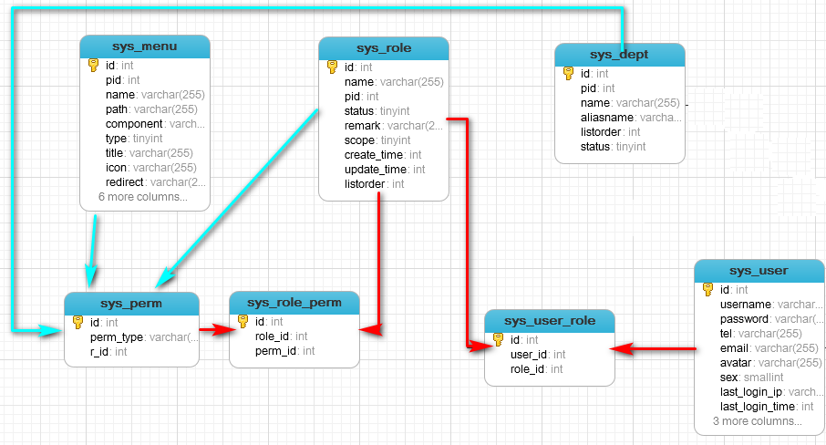

## 数据库表说明

| Tables_in_vueadminv2 | 说明                                      |
|---------------------:|----------------------------------------- |
| keys                 | PHP CI RESTful apikey可config.php开启关闭  |
| logs                 | PHP CI RESTful 日志表可config.php开启关闭   |
| sys_dept             | 系统部门表                                 |
| sys_menu             | 系统菜单表                                 |
| sys_perm             | 系统权限表                                 |
| sys_perm_type        | 权限类型（暂时未用到）                       |
| sys_role             | 系统角色表                                 |
| sys_role_perm        | 角色权限关系表                              |
| sys_user             | 系统用户表                                 |
| sys_user_dept        | 用户所属部门表（可一对多）                    |
| sys_user_role        | 用户角色对应关系                            |
| sys_user_token       | 使用JWT token此表无用                       |
| upload_tbl           | 业务测试表                                  |

## 开发环境/编辑器
- phpstudy_pro `php 7.3.4nts` + `Apache 2.4.39`
- vue.js
- vscode

## 前端目录树
 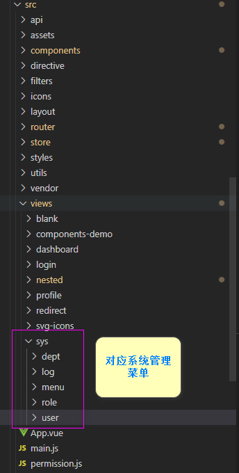
## 多级菜单配置
 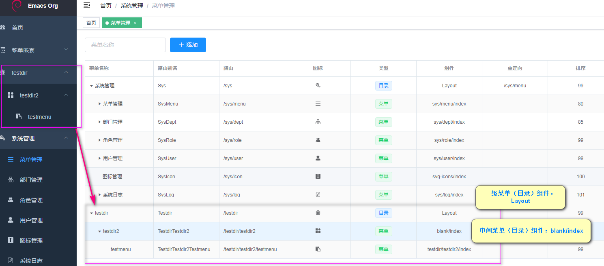

## jwt无缝刷新测试配置

CodeIgniter-3.1.10\application\config\config.php   // `access_token/refresh_token` 过期时间配置

```
$config['jwt_access_token_exp'] = 15; // 单位秒
$config['jwt_refresh_token_exp'] = 180; // 单位秒
```

## jwt无缝刷新效果
 
 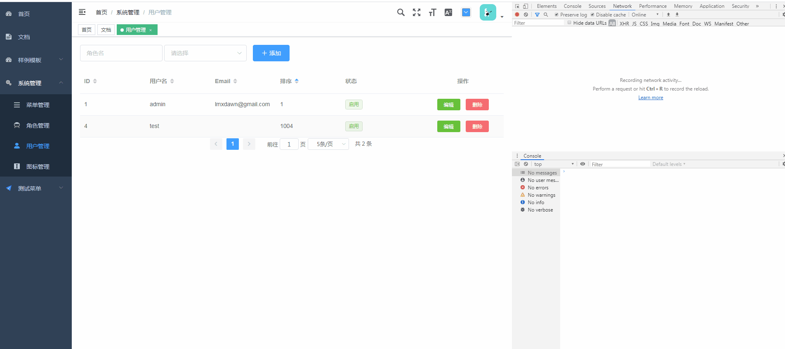
 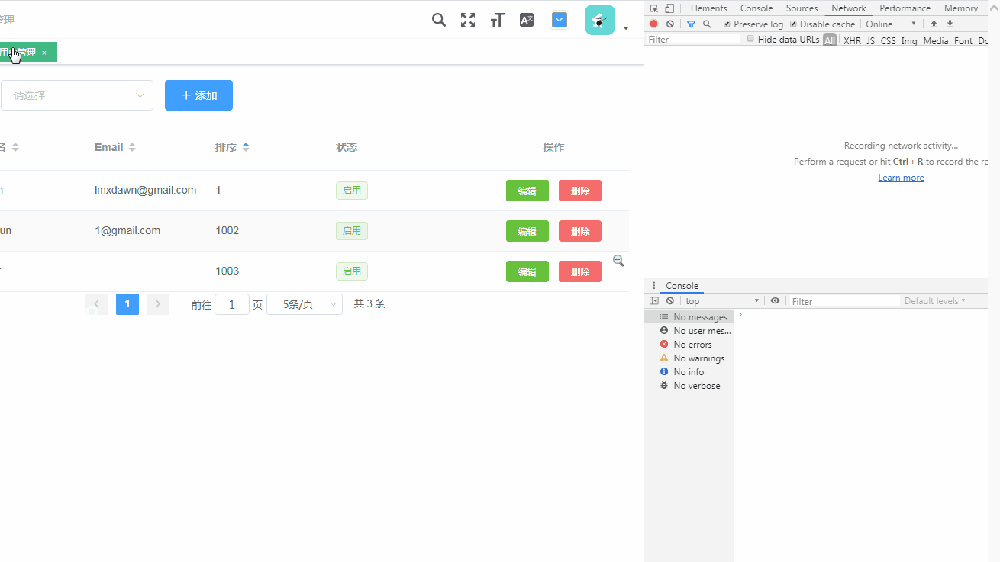

## github 三方认证demo.gif
 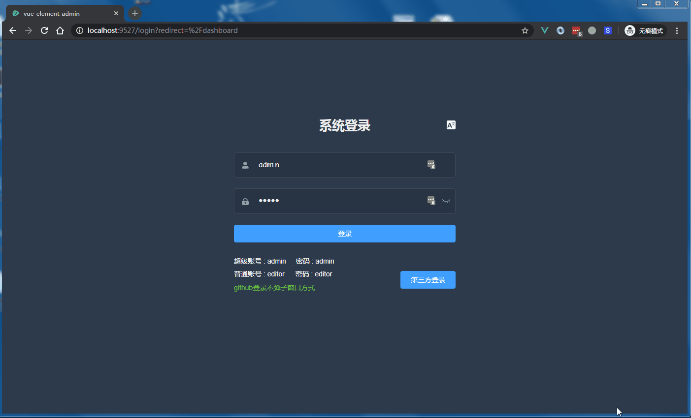

## 截图
 
 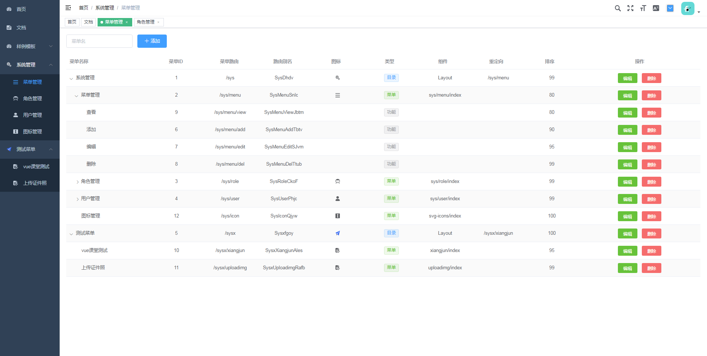
 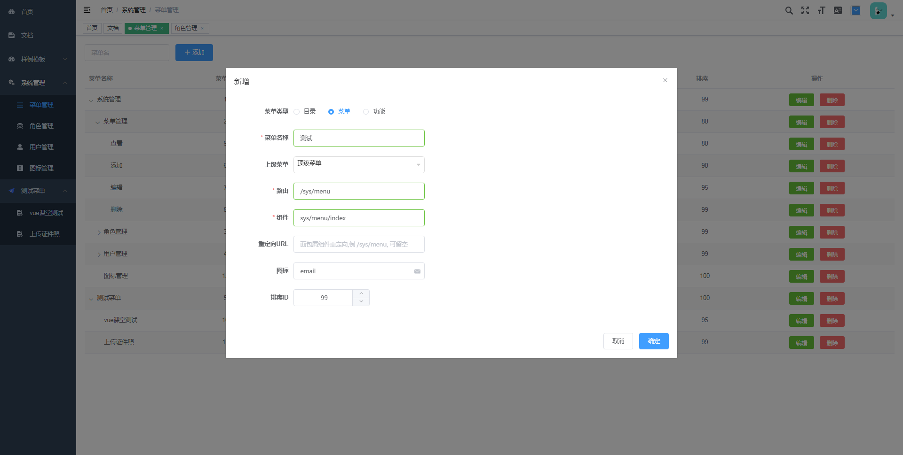
 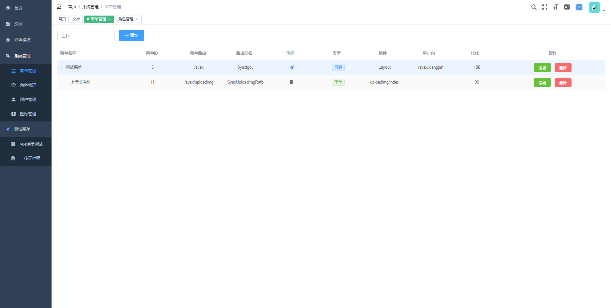 
 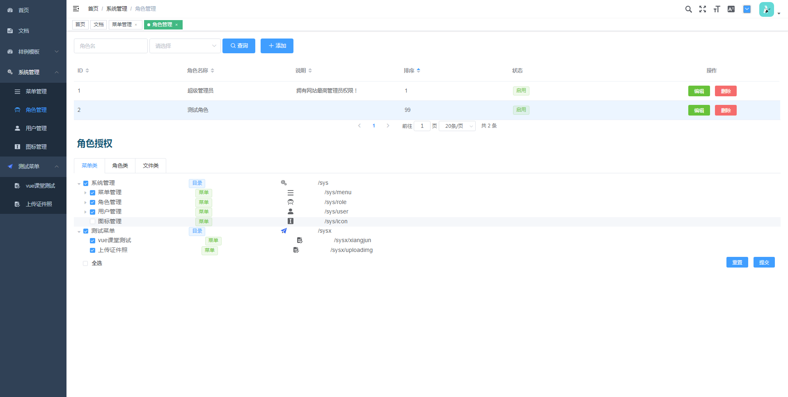
 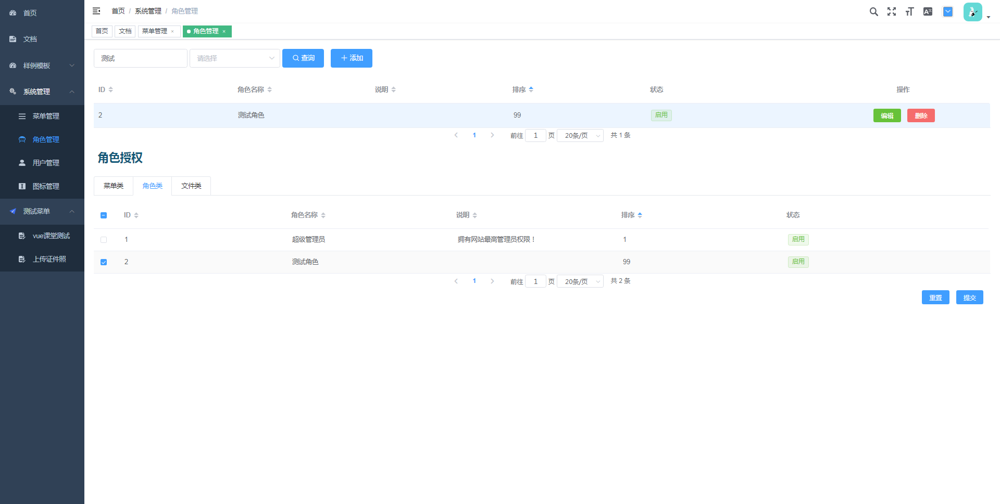
 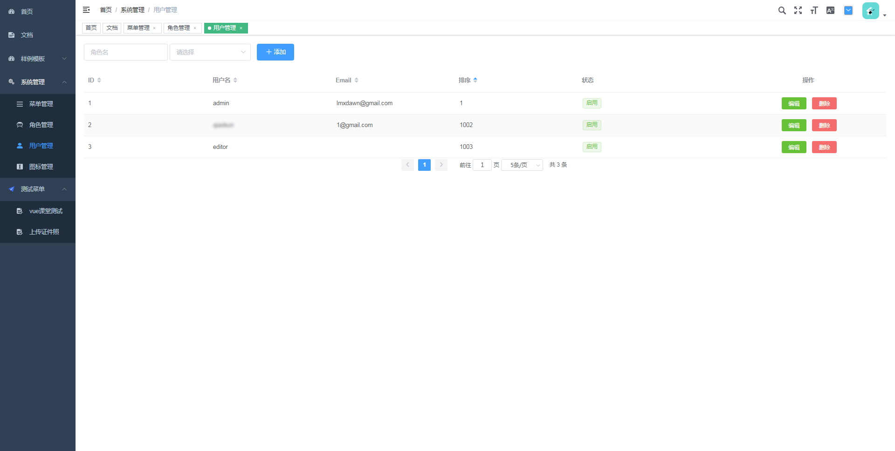
 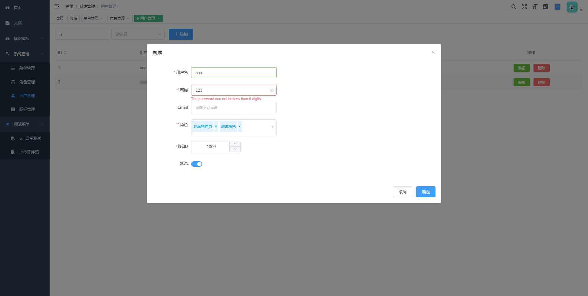
